# Proof — wedge pomodoro user journeys

## ✅ PROVEN — 17/17 assertions across 4 journeys

Against `http://localhost:4173` · 2026-07-19 · [interactive proof — watch the run](REPORT.html)

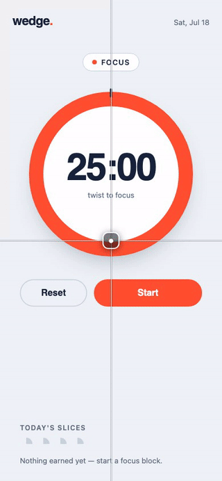

| journey | promise | steps |
| --- | --- | ---: |
| [01-focus-cycle](#01-focus-cycle) | The core promise: a focus block runs, the wedge drains, and completion hands off to a break automatically | ✅ 7/7 |
| [02-pause-resume](#02-pause-resume) | Pause freezes the wedge exactly where it is; Resume continues from there | ✅ 3/3 |
| [03-slices-persist](#03-slices-persist) | A completed focus block earns a slice that survives a full reload | ✅ 4/4 |
| [04-reset-no-credit](#04-reset-no-credit) | Reset restores the full block — and never awards a slice for abandoned work | ✅ 3/3 |

### Before → after

Same journey step on the merge-base build (left) and this branch (right).

| step | before | after |
| --- | --- | --- |
| 01-focus-cycle `idle-focus` | 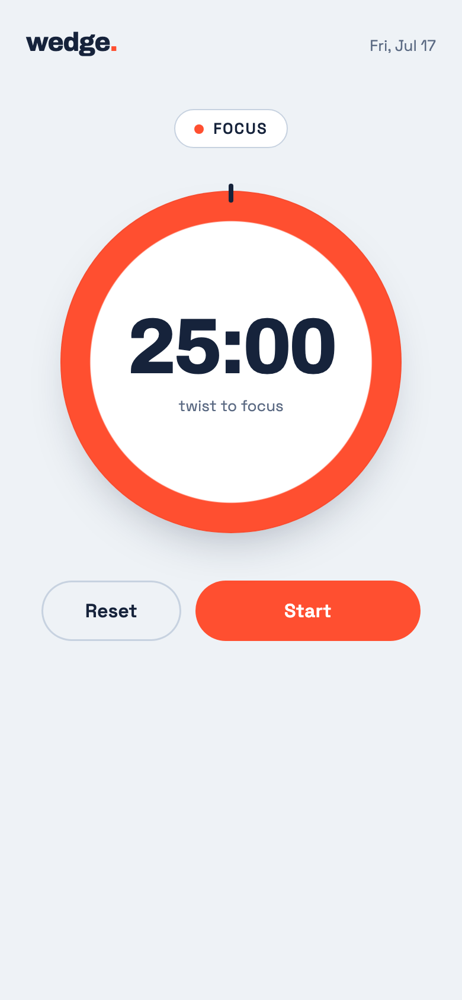 |  |
| 01-focus-cycle `focus-running` | 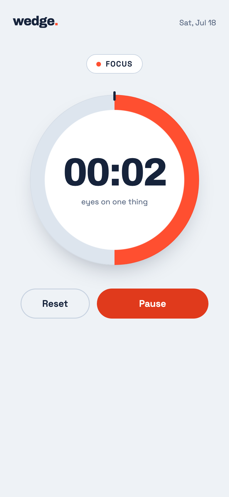 | 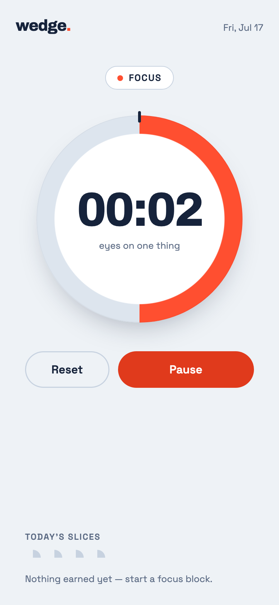 |
| 01-focus-cycle `break-queued` |  | 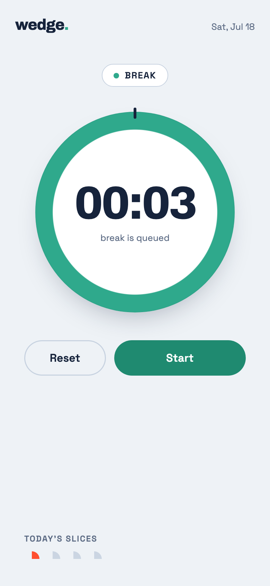 |
| 02-pause-resume `paused` | 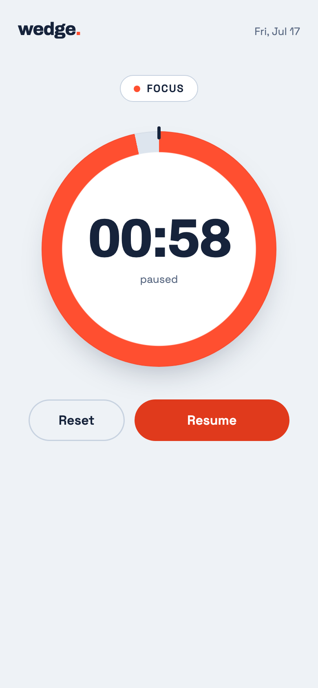 | 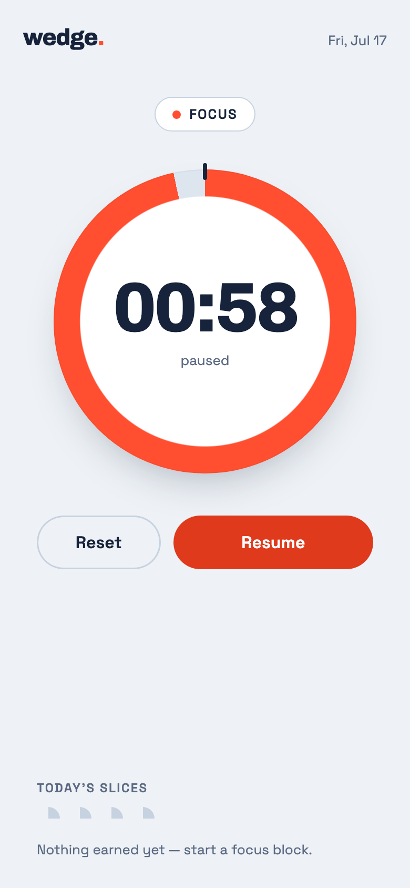 |
| 02-pause-resume `resumed` | 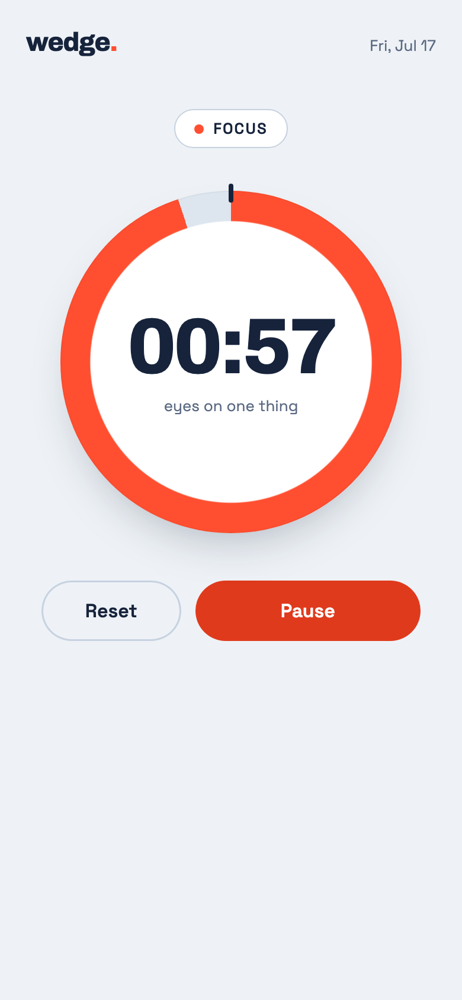 | 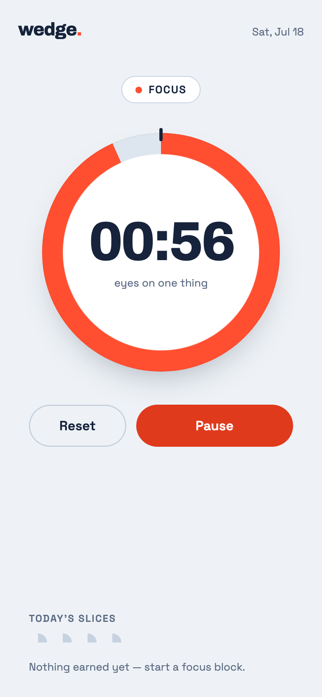 |
| 03-slices-persist `one-slice-earned` |  |  |
| 03-slices-persist `slice-persists-after-reload` |  | 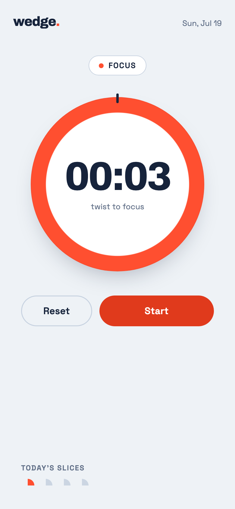 |
| 04-reset-no-credit `reset-full-block` | 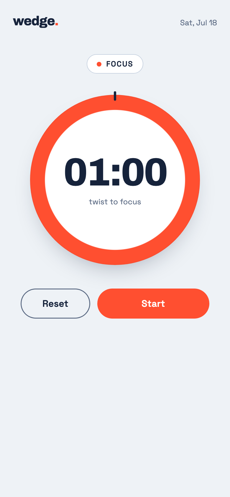 | 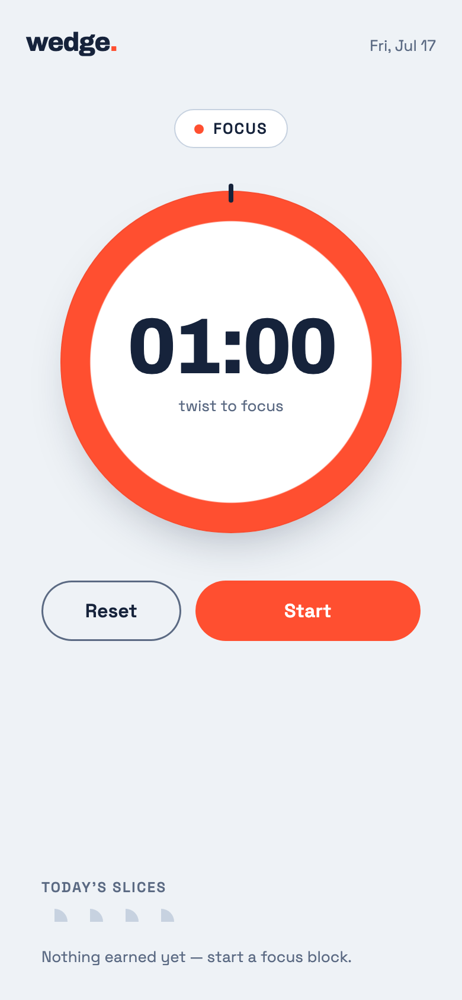 |

## 01-focus-cycle

> The core promise: a focus block runs, the wedge drains, and completion hands off to a break automatically

- ⏸ (manual) grant notification permission — effect staged via API — a human performs this step in real use
- ✅ idle timer shows the full 25:00 focus block
- ✅ mode chip reads Focus
- ✅ primary control offers Start
- ✅ running: control flips to Pause
- ✅ running: wedge is draining (time below 00:04) — 00:03
- ✅ completion hands off to Break automatically
- ✅ break block queued at full 00:03

  

## 02-pause-resume

> Pause freezes the wedge exactly where it is; Resume continues from there

- ✅ paused time does not move — 00:58
- ✅ control offers Resume while paused
- ✅ resume continues the countdown

 

## 03-slices-persist

> A completed focus block earns a slice that survives a full reload

- ✅ empty state invites the first block
- ✅ one slice earned after completing a block
- ✅ the earned slice survives a reload
- ✅ empty-state prompt stays gone

 

## 04-reset-no-credit

> Reset restores the full block — and never awards a slice for abandoned work

- ✅ reset restores the full block
- ✅ control returns to Start
- ✅ no slice awarded for an abandoned block

## Viewport sweep

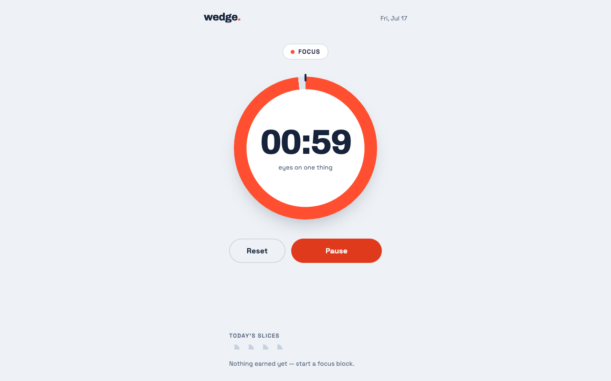 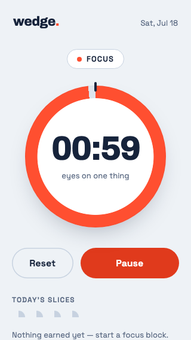 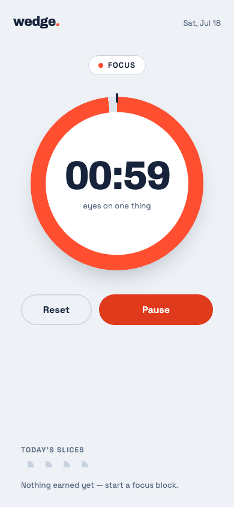 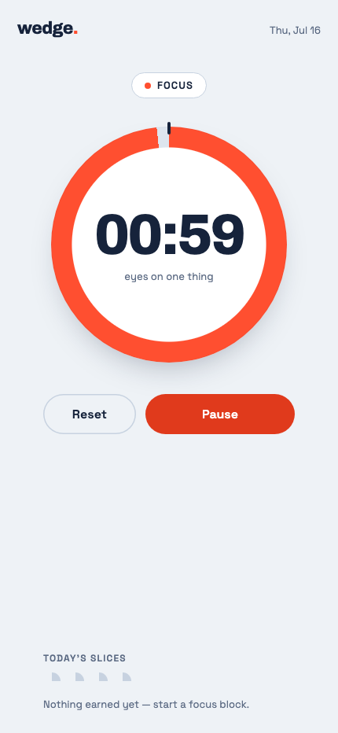 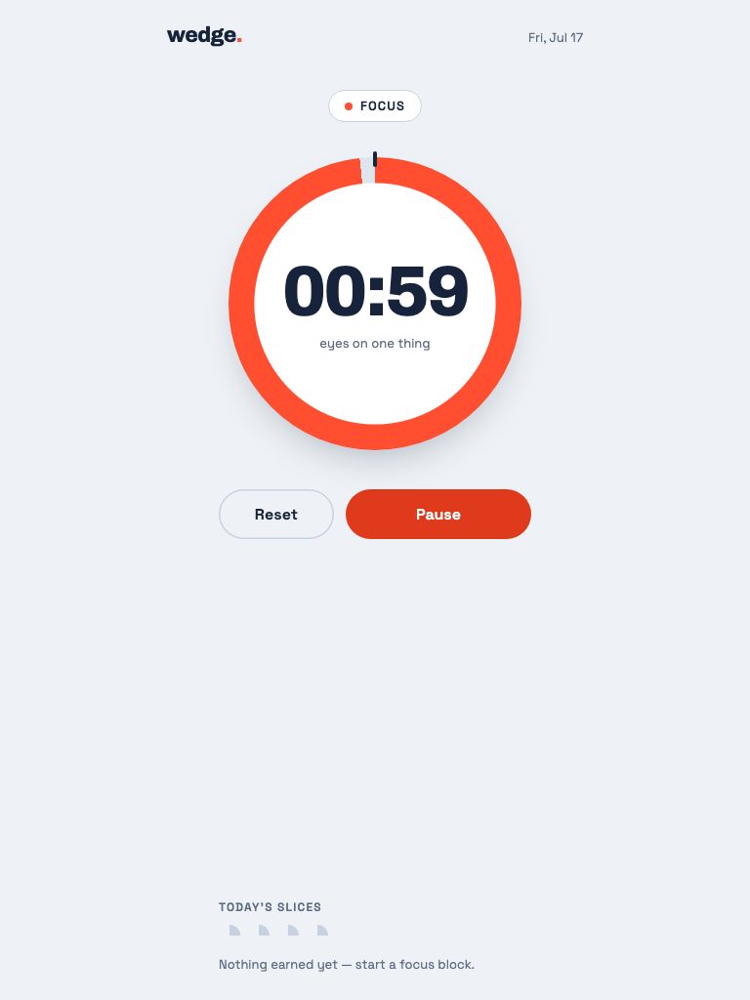
