# Proof — wedge pomodoro user journeys

## ✅ PROVEN — 17/17 assertions across 4 journeys

Against `http://localhost:4173` · 2026-07-31 · [interactive proof — watch the run](REPORT.html)

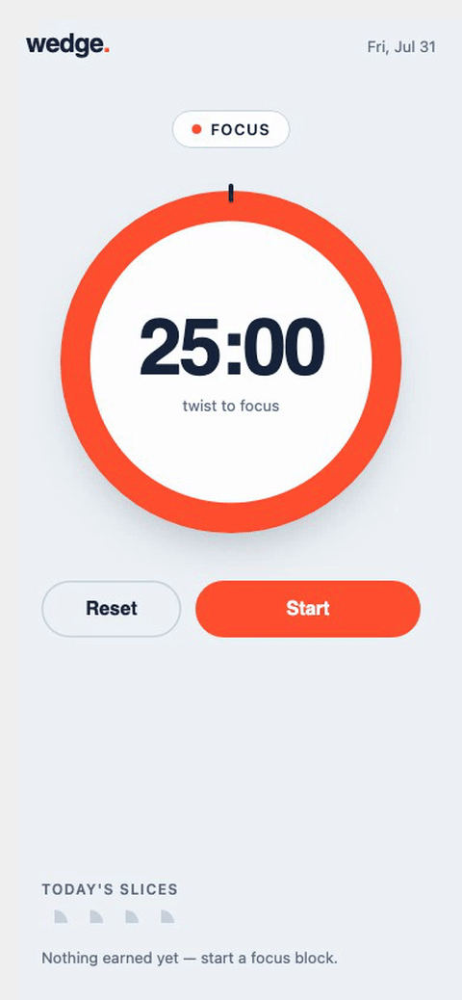

| journey | promise | steps |
| --- | --- | ---: |
| [01-focus-cycle](#01-focus-cycle) | The core promise: a focus block runs, the wedge drains, and completion hands off to a break automatically | ✅ 7/7 |
| [02-pause-resume](#02-pause-resume) | Pause freezes the wedge exactly where it is; Resume continues from there | ✅ 3/3 |
| [03-slices-persist](#03-slices-persist) | A completed focus block earns a slice that survives a full reload | ✅ 4/4 |
| [04-reset-no-credit](#04-reset-no-credit) | Reset restores the full block — and never awards a slice for abandoned work | ✅ 3/3 |

### Before → after

Same journey step on the merge-base build (left) and this branch (right).

| step | before | after |
| --- | --- | --- |
| 01-focus-cycle `idle-focus` | 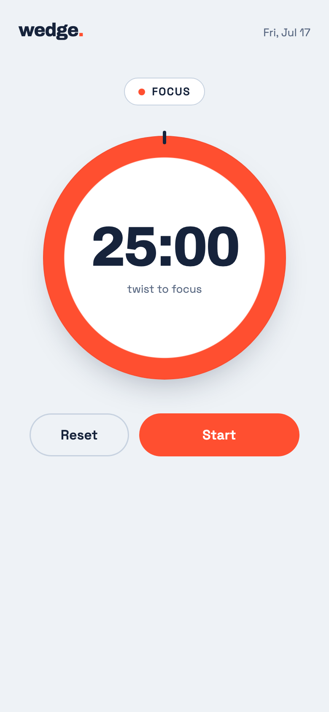 |  |
| 01-focus-cycle `focus-running` | 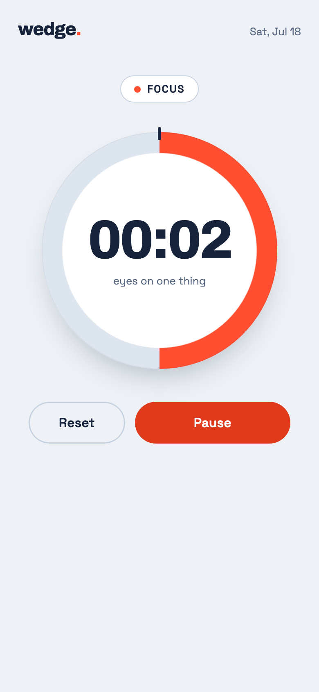 | 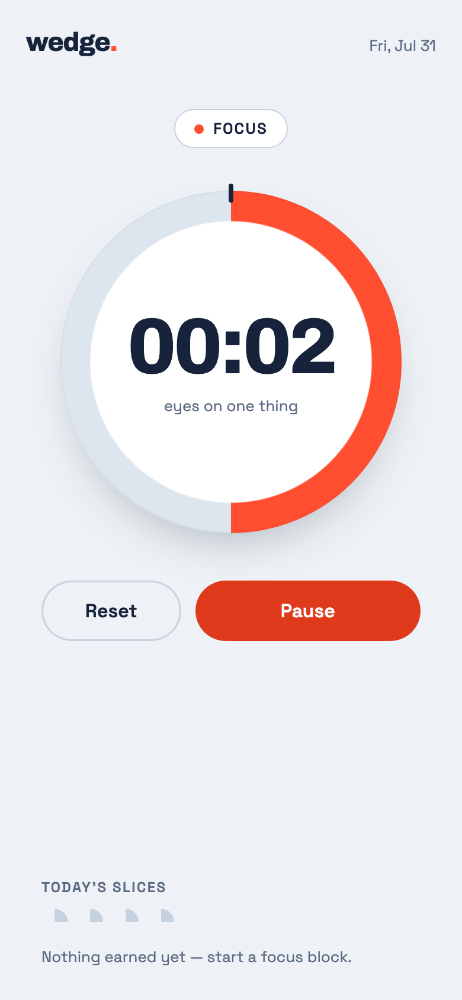 |
| 01-focus-cycle `break-queued` |  |  |
| 02-pause-resume `paused` | 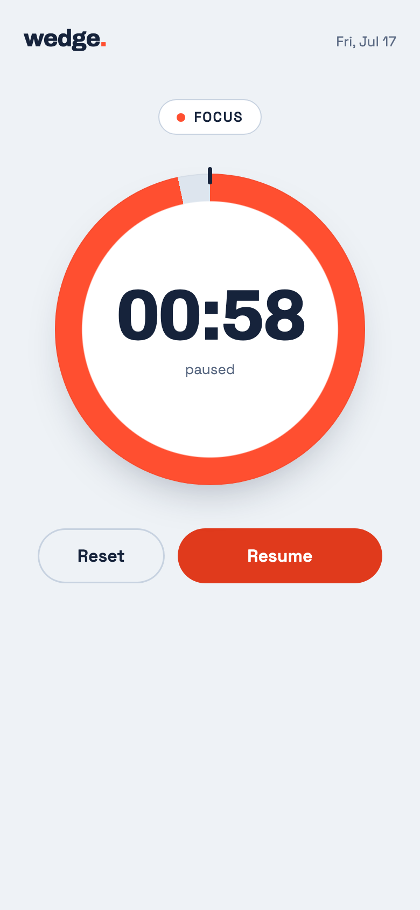 | 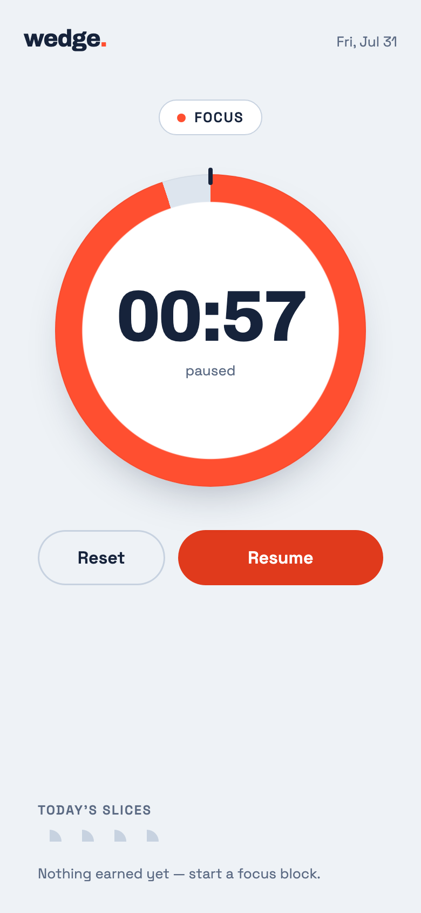 |
| 02-pause-resume `resumed` | 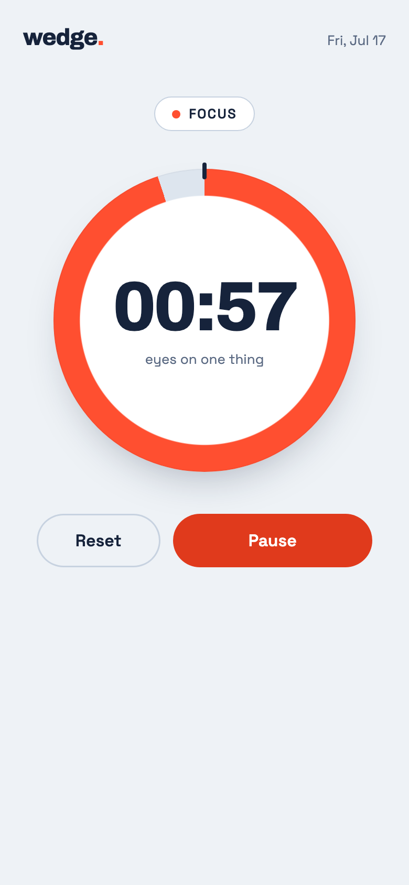 | 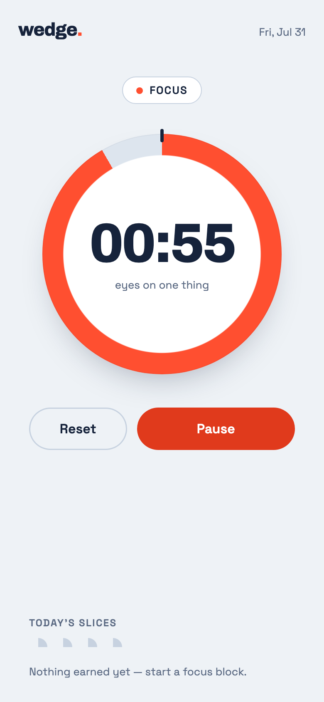 |
| 03-slices-persist `one-slice-earned` |  | 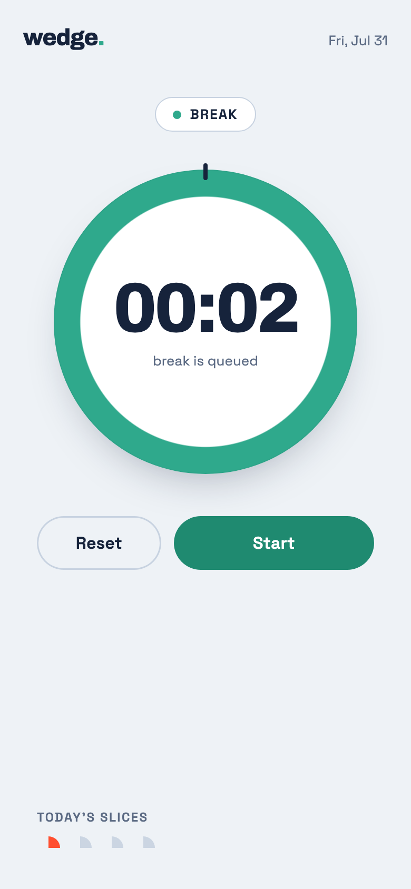 |
| 03-slices-persist `slice-persists-after-reload` | 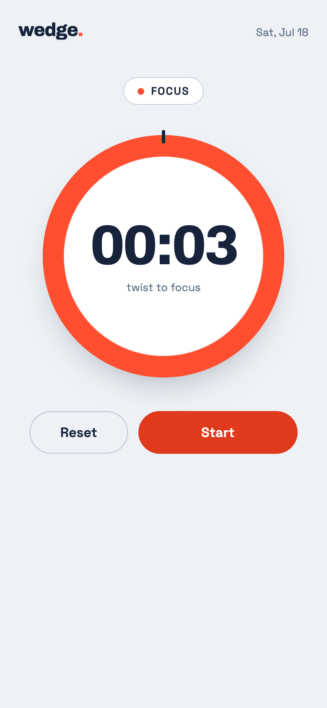 |  |
| 04-reset-no-credit `reset-full-block` | 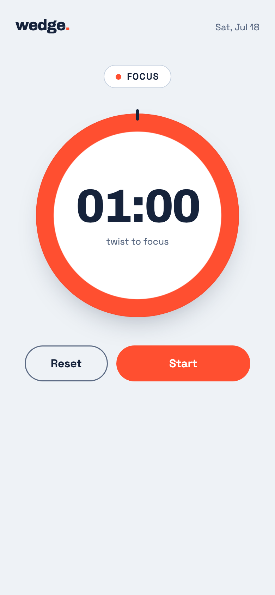 | 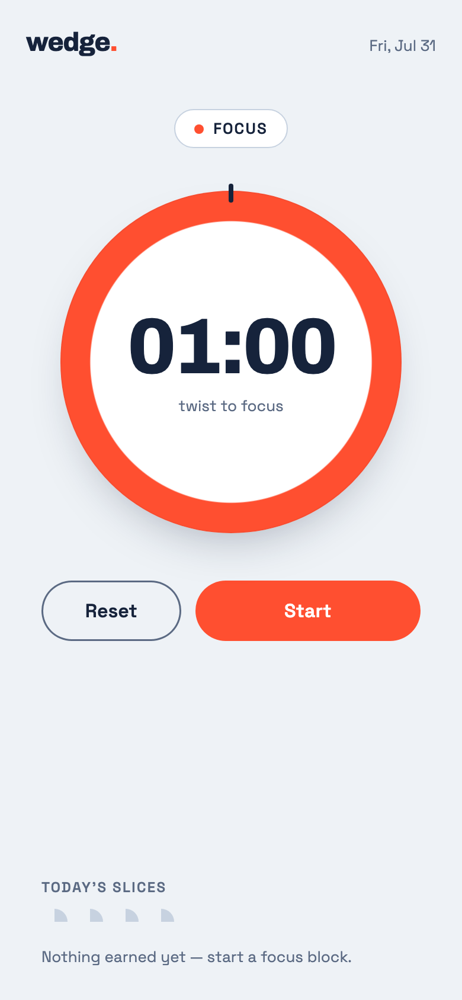 |

## 01-focus-cycle

> The core promise: a focus block runs, the wedge drains, and completion hands off to a break automatically

- ⏸ (manual) grant notification permission — effect staged via API — a human performs this step in real use
- ✅ the timer is ready with a full 25-minute block — reads 25:00
- ✅ it starts in Focus mode, not on a break
- ✅ the main button invites her to Start
- ✅ the block is running — the button now offers Pause
- ✅ the countdown is ticking down — now at 00:03
- ✅ when the block ends it moves her to a break by itself
- ✅ the break starts fresh, at its full length — reads 00:03

  

## 02-pause-resume

> Pause freezes the wedge exactly where it is; Resume continues from there

- ✅ while paused, the clock does not lose a second — still 00:57
- ✅ the button now offers to Resume
- ✅ it carries on from where it stopped, not from the top — resumed below 00:57

 

## 03-slices-persist

> A completed focus block earns a slice that survives a full reload

- ✅ she has earned nothing yet, and the app says so
- ✅ finishing the block earns her a slice
- ✅ the slice she earned is still there
- ✅ and the app no longer says she has nothing

 

## 04-reset-no-credit

> Reset restores the full block — and never awards a slice for abandoned work

- ✅ the timer goes back to a full, untouched block — reads 01:00
- ✅ the button offers Start again, as if nothing had run
- ✅ and crucially she earns NO slice for the abandoned work

## Viewport sweep

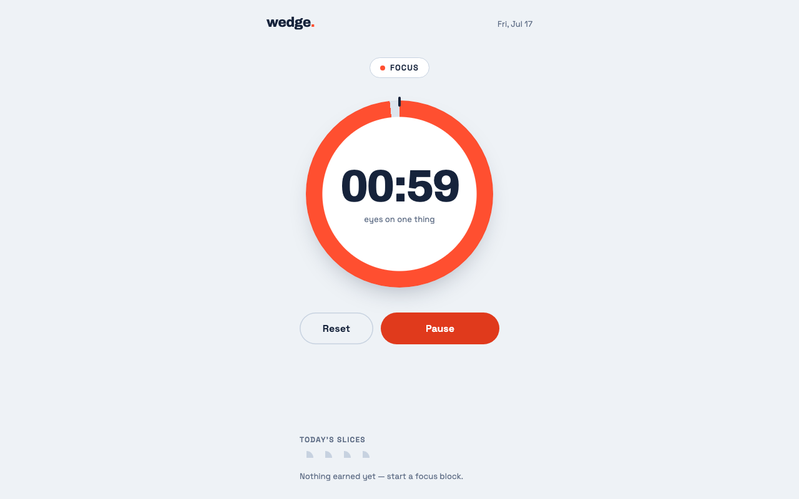 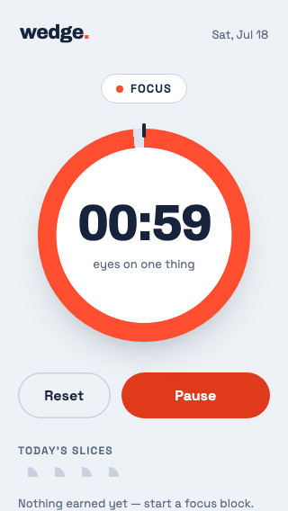 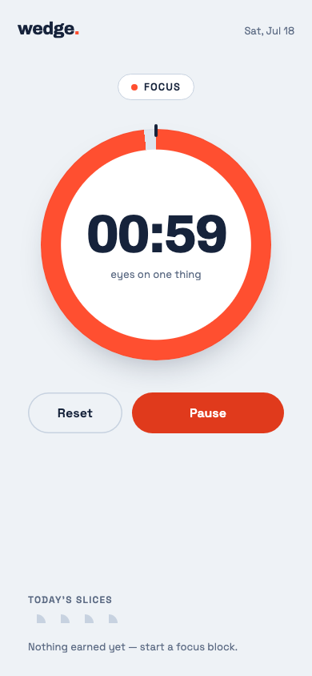 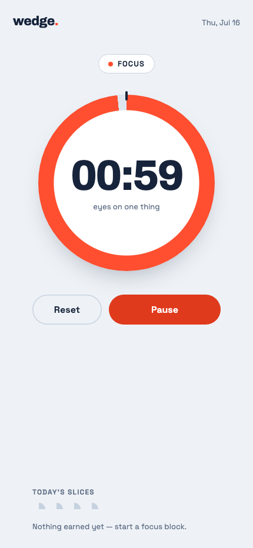 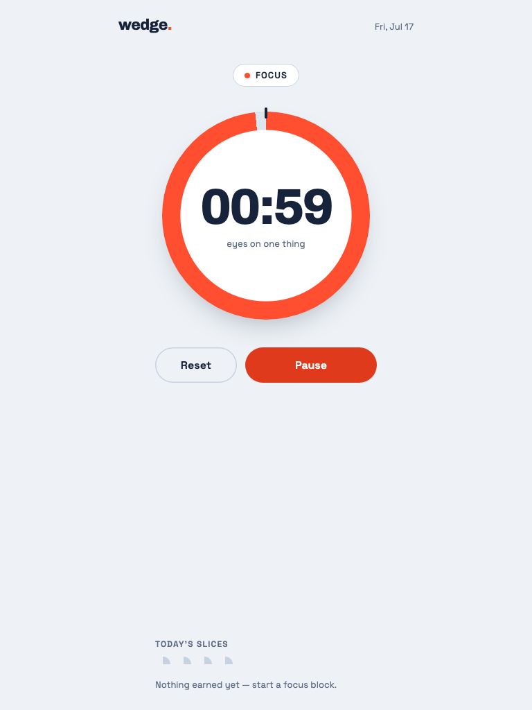
